# Training Engine Architecture

A visual tour of the **continuous-batched MultiLoRA training engine**: what the
pieces are, **what data flows between them**, and **how a job runs end-to-end**.

The guiding principle is a strict separation of authority:

```text
The coordinator decides.   (single-writer control plane, CPU, torch-free)
Megatron workers execute.  (stateless execution plane, GPU)
The coordinator commits.   (all-or-nothing)
```

One central `TrainingCoordinator` (a Ray actor) owns *all* global state and emits
immutable `TrainStepPlan`s. Every Megatron worker receives the **same** plan,
executes it against its local model/optimizer shard, and returns a
`WorkerStepResult`. Workers never mutate shared state.

> Companion docs: `DESIGN.md` (prose rationale) and
> `revised_v2_multilora_training_engine_design.md` (full design spec). This file
> is the diagram-first view.

---

## 1. The big picture

Four planes cooperate. Clients talk only HTTP; the GPU is reached only through
the coordinator's plans.

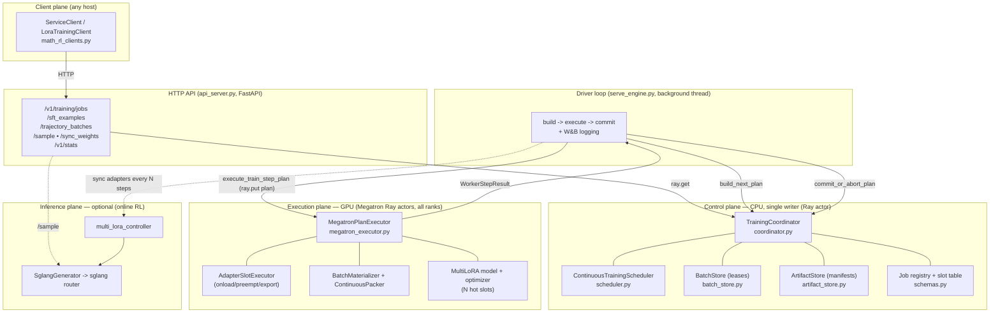

**Who owns what**

| Plane | Process | Owns | torch? | Ray? |
|---|---|---|---|---|
| Control | 1 Ray actor (CPU) | jobs, leases, slots, versions, scheduling | no | actor only |
| Driver | background thread on the head | the build/execute/commit loop + logging | no | yes |
| Execution | Megatron Ray actors (every GPU rank) | model + optimizer tensors, slot ops | yes | yes |
| Inference | sglang router (optional) | rollout generation for online RL | yes | yes |

---

## 2. Three identities (don't conflate them)

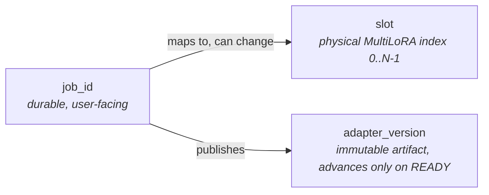

- **`job_id`** — the durable handle a client keeps.
- **`slot`** — a physical adapter index in the model. A job is *paged in* to a
  slot when HOT and *paged out* when COLD; its slot can change over its life.
- **`adapter_version`** — a published artifact version. Only advances when a
  durable manifest becomes `READY`. External rollouts reference
  `(job_id, adapter_version)` — **never** a slot.

---

## 3. Orthogonal job state

A job does not have one mixed status enum. It carries **four independent** state
axes (`schemas.py`), and predicates like `is_runnable` / `can_preempt` are
computed over them.

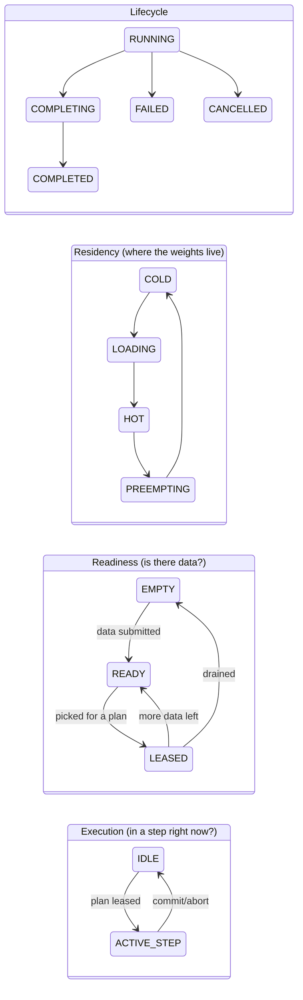

A job is **runnable** only when all four line up:

```text
is_runnable(job) ==
    Lifecycle.RUNNING
    and Readiness.READY
    and Execution.IDLE
    and ready_train_tokens >= scheduling.min_tokens_per_train_quantum
```

---

## 4. What data is passed around

The system has a small set of typed contracts (`schemas.py`, `plan.py`,
`results.py`). This is the "vocabulary" everything else speaks.

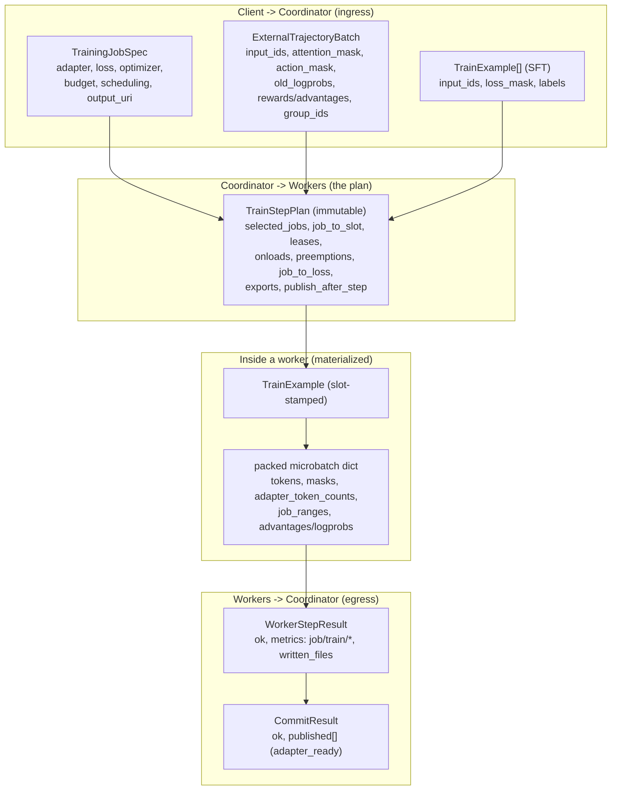

**Key payloads at a glance**

| Type | Direction | Carries | Defined in |
|---|---|---|---|
| `TrainingJobSpec` | client → coordinator | adapter (rank/alpha/targets), `LossSpec`, `OptimizerSpec`, `BudgetSpec`, `SchedulingSpec` | `schemas.py` |
| `ExternalTrajectoryBatch` | client → coordinator | tokenized RL rollouts + `old_logprobs` + rewards/advantages, `client_batch_id` | `schemas.py` |
| `TrainExample` | internal | one sequence: `input_ids`, masks, `labels`/logprobs, `slot` | `schemas.py` |
| `BatchLease` | store → plan | `payload_ref` (Ray ObjectRef) + `token_count` + version | `plan.py` |
| `TrainStepPlan` | coordinator → workers | the whole step: jobs, slots, leases, slot ops, exports | `plan.py` |
| `WorkerStepResult` | worker → coordinator | `ok`, per-adapter `metrics`, `written_files` | `results.py` |

---

## 5. The central loop (one engine step)

`serve_engine._run_training_loop` drives a build → execute → commit cycle. Data
is **leased**, not consumed, until the plan commits — so a worker failure loses
nothing.

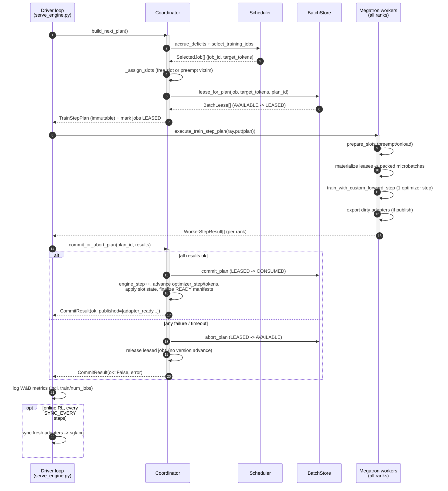

---

## 6. Slots: paging adapters in and out

There are only `N` hot GPU slots (`ENGINE_N_ADAPTERS`, default 16) but possibly
hundreds of jobs. The coordinator pages adapters between **HOT** (resident in a
model slot) and **COLD** (checkpointed to disk).

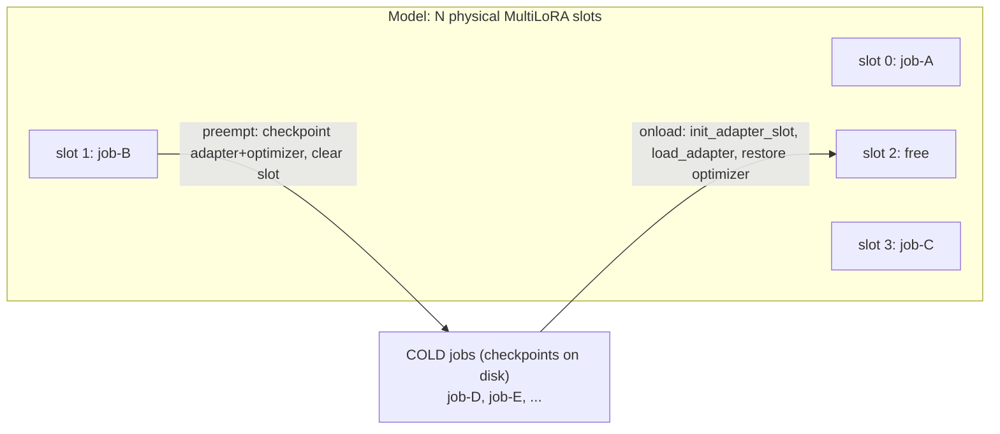

**Onload vs preempt (executed by `AdapterSlotExecutor` on every rank):**

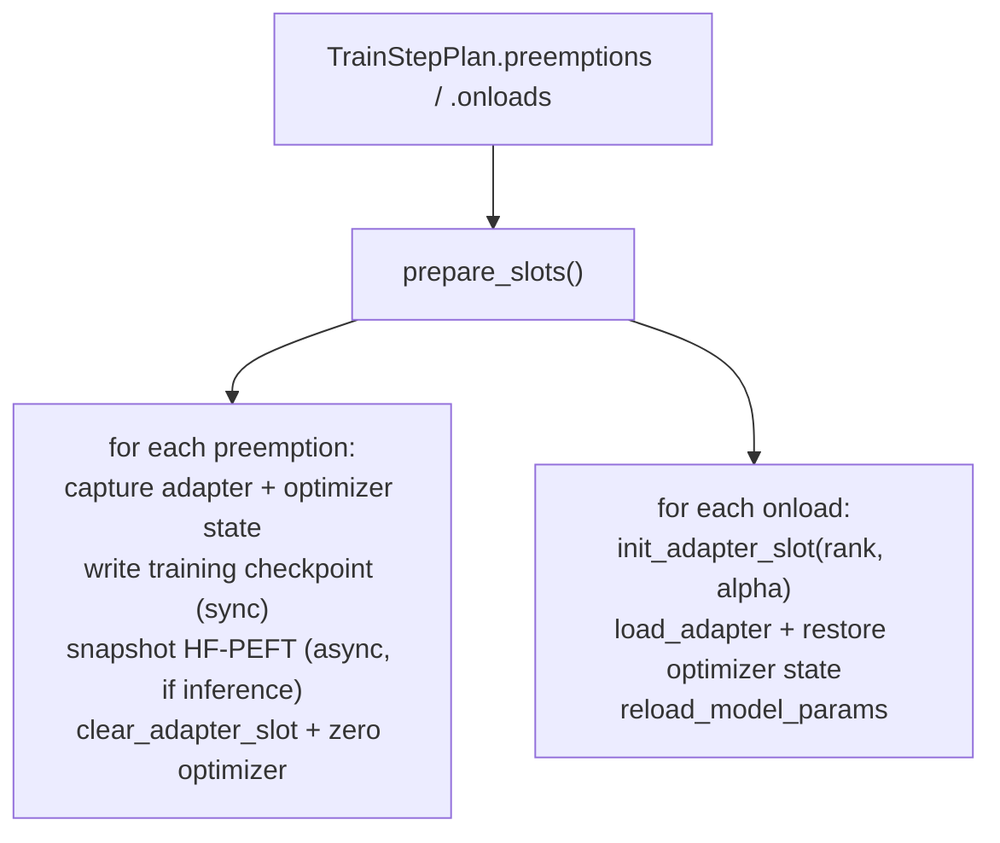

Slot assignment policy lives in `coordinator._assign_slots`: prefer a **free**
slot; otherwise ask the scheduler to `choose_preemption_victim` (idle-first,
least-under-served, longest-hogger, lowest-priority). A job pinned HOT for fewer
than `min_hot_steps` (default 2) cannot be preempted (`can_preempt`).

> Optimizer state survives slot moves because
> `iter_adapter_named_params_for_slot` uses **slot-independent** keys, so Adam
> moments captured from slot 1 restore cleanly into slot 2.

---

## 7. From leased payloads to a packed microbatch

This is the heart of "continuous batching": multiple adapters share one Megatron
step, and tokens must be **sorted by physical slot** so `MultiLoRALinear` can
route contiguous token ranges to the right adapter.

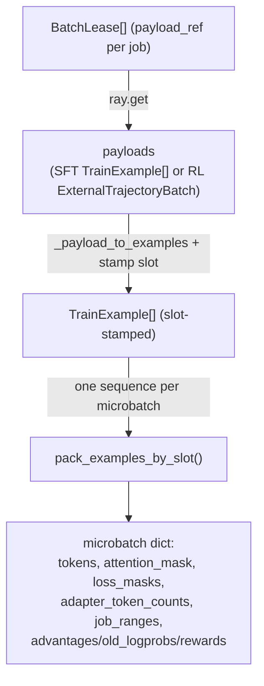

**The slot-sorted layout invariant** (`continuous_packer.plan_packed_layout`):
flattened tokens are grouped by slot, and `adapter_token_counts[i]` equals the
number of contiguous tokens routed to slot `i`.

```text
flattened tokens:   [ slot 0 tokens | slot 1 tokens | slot 3 tokens | pad ]
adapter_token_counts = [ n0,            n1,           0,  n3+pad ]   (sums to total)
                                                      ^ slot 2 unused -> 0
```

Padding to a multiple is appended to the **last used slot** with
attention/loss masks zeroed, so it never affects gradients while keeping the
per-slot counts summing to the total token count.

> MVP detail: the materializer emits **one sequence per microbatch** (normal
> causal attention). Gradients accumulate across microbatches into disjoint
> per-slot params, producing one optimizer step.

---

## 8. The worker forward/backward + per-adapter metrics

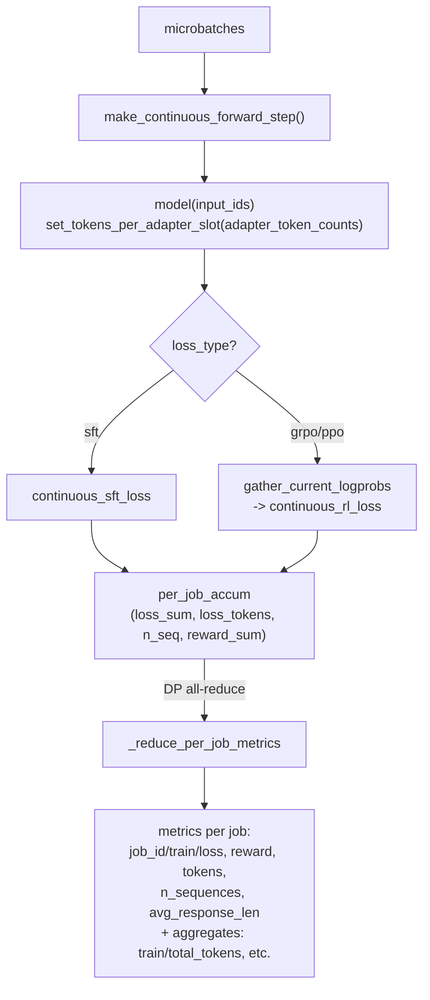

Per-adapter raw sums are accumulated across microbatches on the last pipeline
stage, then data-parallel reduced after the step so per-adapter loss/reward are
correct across DP/CP shards. The driver maps these into W&B under each adapter's
own `{job_id}/...` section, all on a shared `engine/step` x-axis (plus
step-level aggregates like `train/num_jobs`).

---

## 9. End-to-end walkthrough A — an SFT job

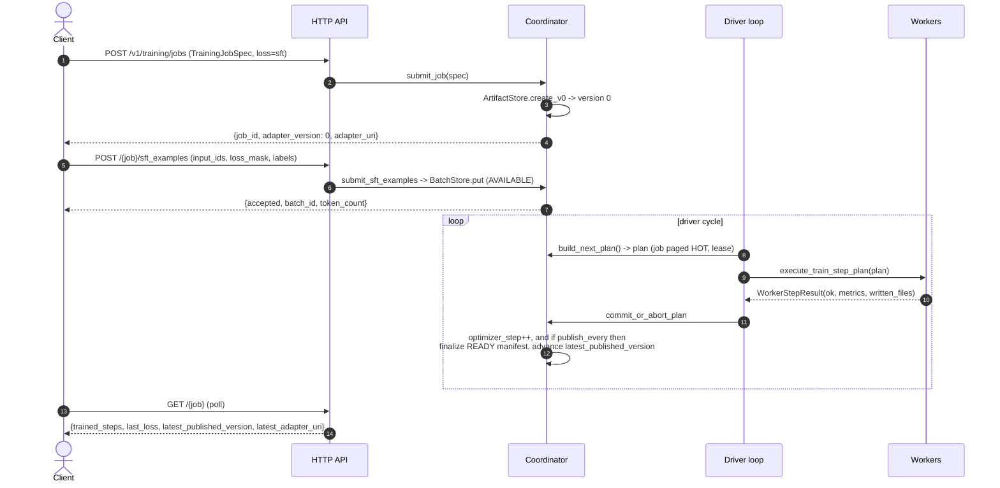

---

## 10. End-to-end walkthrough B — an online RL (GRPO) job

This is the loop in `examples/training_engine/math_rl_clients.py`: **sample →
grade client-side → submit scored rollouts → train**, repeated. Rewards are
computed entirely on the client; the engine only generates and trains.

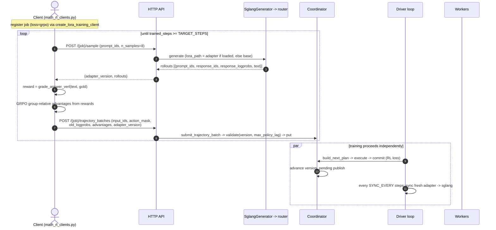

**Why `adapter_version` matters here:** submitted rollouts are validated against
the job's *published* version and rejected if the policy lag exceeds
`max_policy_lag` (default 4) — this bounds off-policyness. The `/sample`
endpoint only routes to a job's adapter once it's actually loaded in sglang;
before that, the fresh (untrained) adapter is equivalent to the base policy, so
it samples the base model.

---

## 11. Scheduling & fairness (deficit-weighted)

Fairness is measured in **trained tokens**. Each runnable/backlogged job accrues
a per-tick credit proportional to its priority; selection spends that credit.

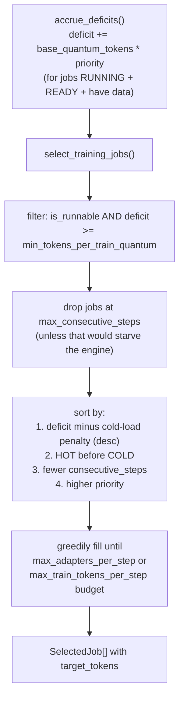

`target_tokens` per job is `min(remaining_budget, tokens_per_update,
ready_train_tokens, deficit_tokens)`. Cold jobs pay a `base_quantum_tokens`
penalty so the engine doesn't page in a cold adapter just to run a tiny quantum.

**When does a step dispatch at all?** (`_should_dispatch`) — when accumulated
ready tokens hit `max_train_tokens_per_step`, OR the oldest waiting job has
waited `max_batch_wait_s` (default 0.25s), OR workers are otherwise idle.

---

## 12. Data safety: leases, idempotency, backpressure

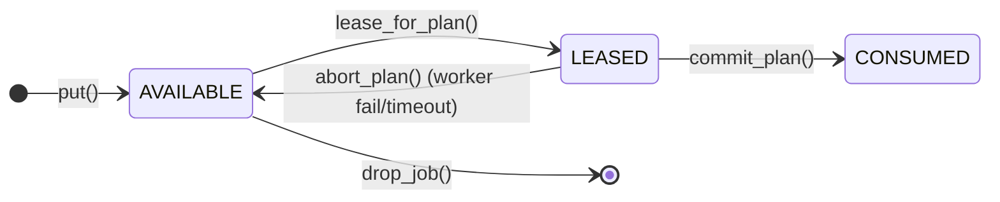

- **Leases, not pops:** an aborted plan returns its batches to `AVAILABLE`, so a
  worker failure or step timeout never loses data.
- **Idempotency:** `client_batch_id` dedupes retried submissions
  (`client_id_index`).
- **Backpressure:** `QueueLimits` rejects submissions past
  `max_ready_tokens_per_job` (`job_backpressure`) or
  `max_ready_tokens_global` (`engine_backpressure`).
- **Payloads stay out of the coordinator:** only a `payload_ref` (Ray ObjectRef)
  and metadata live in the store; workers `ray.get` the payload at materialize
  time.

---

## 13. Versioning & artifacts

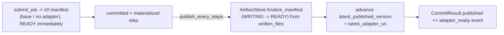

Internal `optimizer_step` advances on every committed step; the **public**
`latest_published_version` only advances once a durable manifest is `READY`. RL
submissions are always validated against the *published* version.

---

## 14. Module map (where to look)

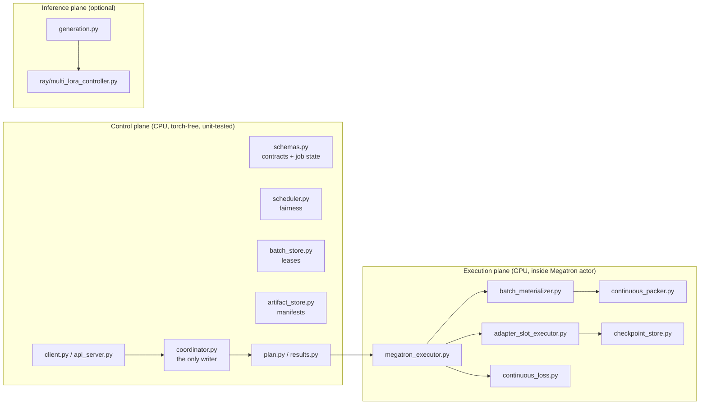

| Concern | File |
|---|---|
| Job state, specs, validation, policies | `schemas.py` |
| Deficit fairness, victim selection | `scheduler.py` |
| Lease / commit / abort, idempotency, backpressure | `batch_store.py` |
| `v0` + atomic WRITING→READY manifests | `artifact_store.py` |
| The single writer; plan build + commit | `coordinator.py` |
| Immutable plan / result types | `plan.py`, `results.py` |
| Thin client + HTTP surface | `client.py`, `api_server.py` |
| Worker step orchestration + metrics | `megatron_executor.py` |
| Slot onload/preempt/export | `adapter_slot_executor.py` |
| Leases → slot-stamped microbatches | `batch_materializer.py` |
| Slot-sorted packing + `adapter_token_counts` | `continuous_packer.py` |
| Per-job SFT / RL loss | `continuous_loss.py` |
| Online-RL generation wrapper | `generation.py` |
| Driver loop + W&B logging | `examples/training_engine/serve_engine.py` |

---

## 15. Running it

- `examples/training_engine/run_engine_serve.sh` — launch the engine service.
- `examples/training_engine/serve_engine.py` — coordinator + workers + HTTP API +
  driver loop (env knobs documented in its module docstring, e.g.
  `ENGINE_N_ADAPTERS`, `ENGINE_ENABLE_GENERATION`, `ENGINE_SYNC_EVERY`).
- `examples/training_engine/math_rl_clients.py` — many-adapter GRPO client over
  three math datasets (the online-RL walkthrough in §10).
- `examples/training_engine/engine_client_demo.py` — minimal client demo.
